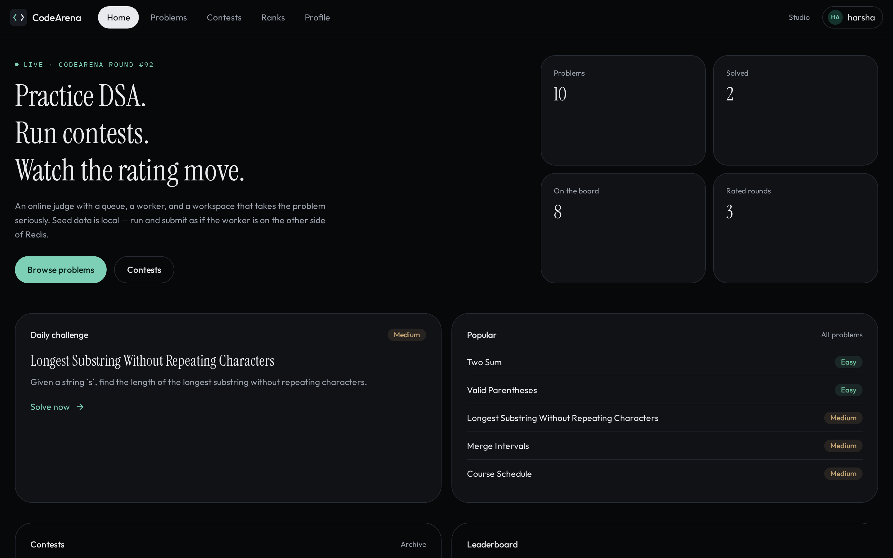
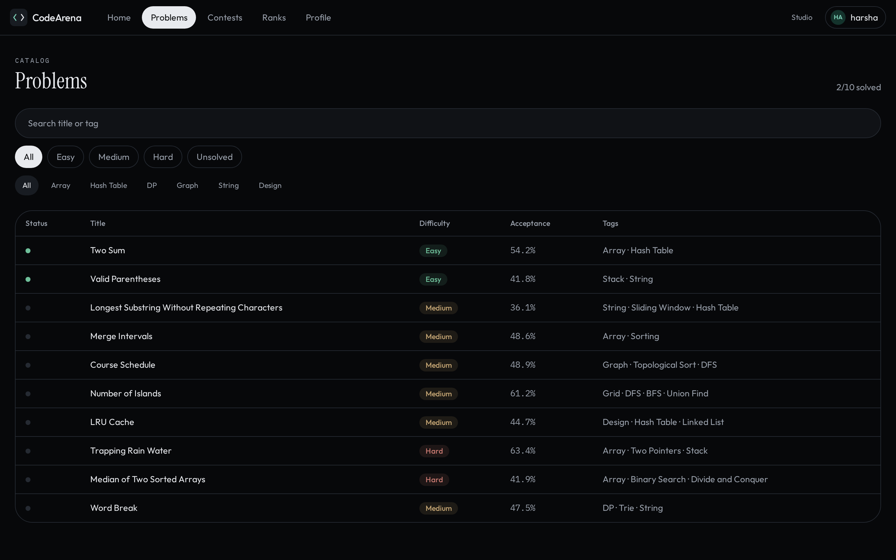
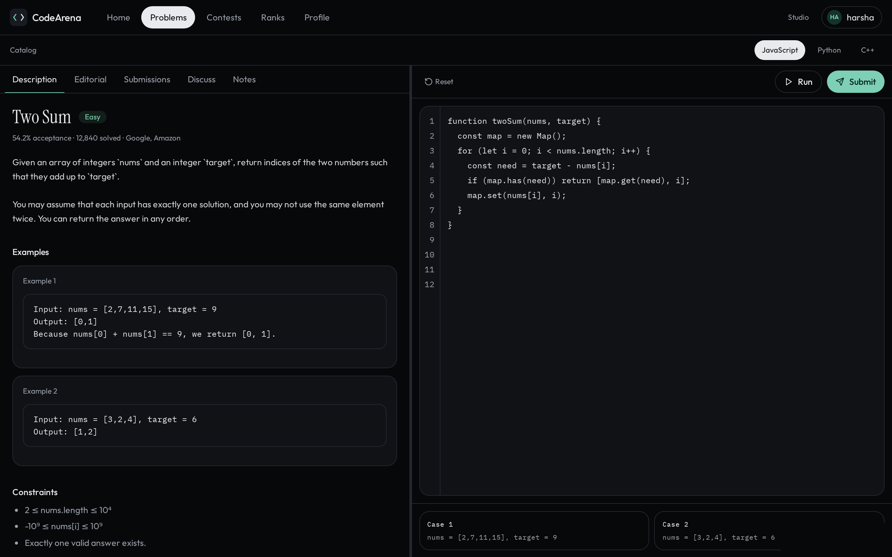
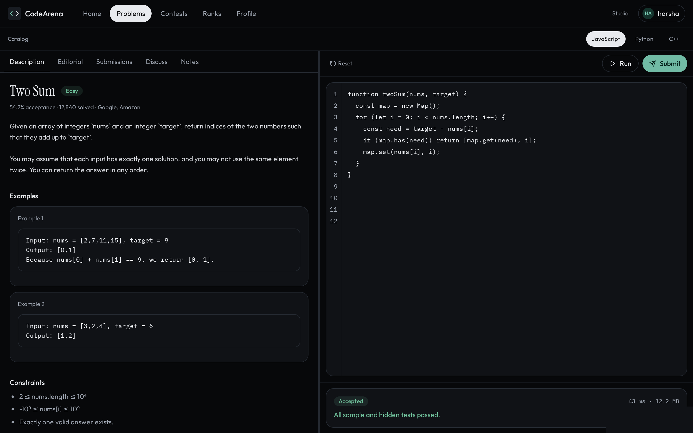
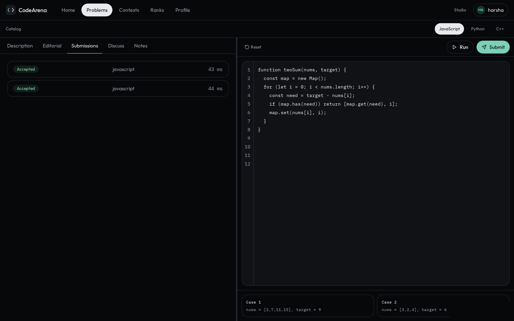
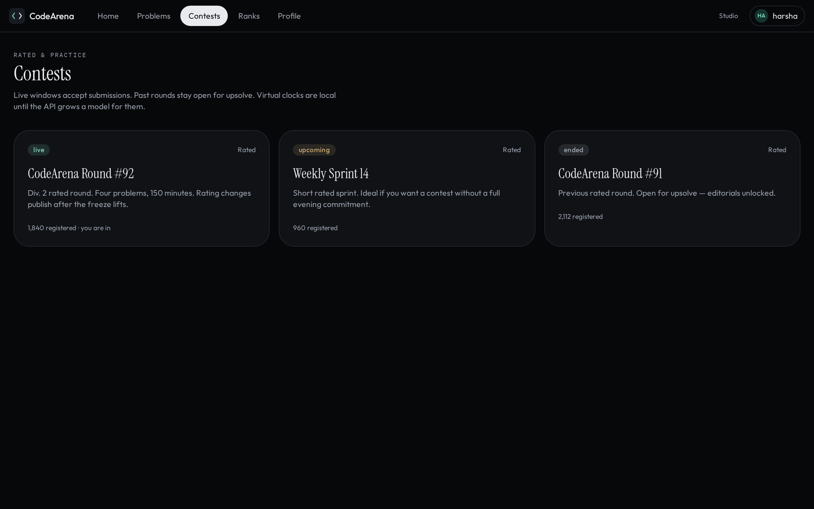
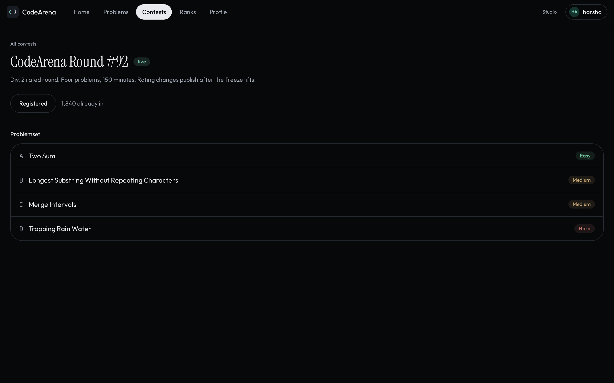
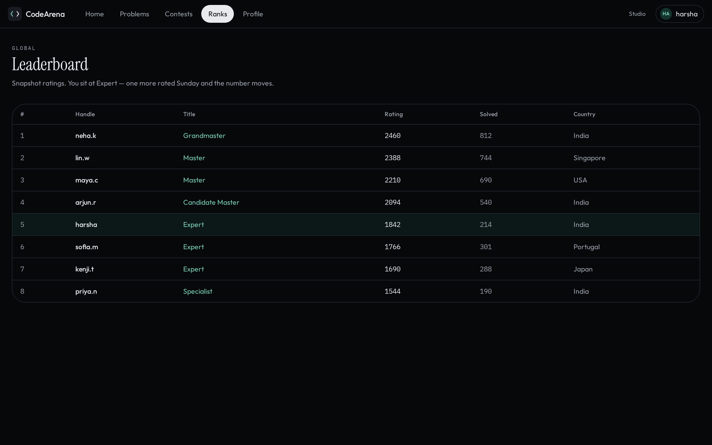
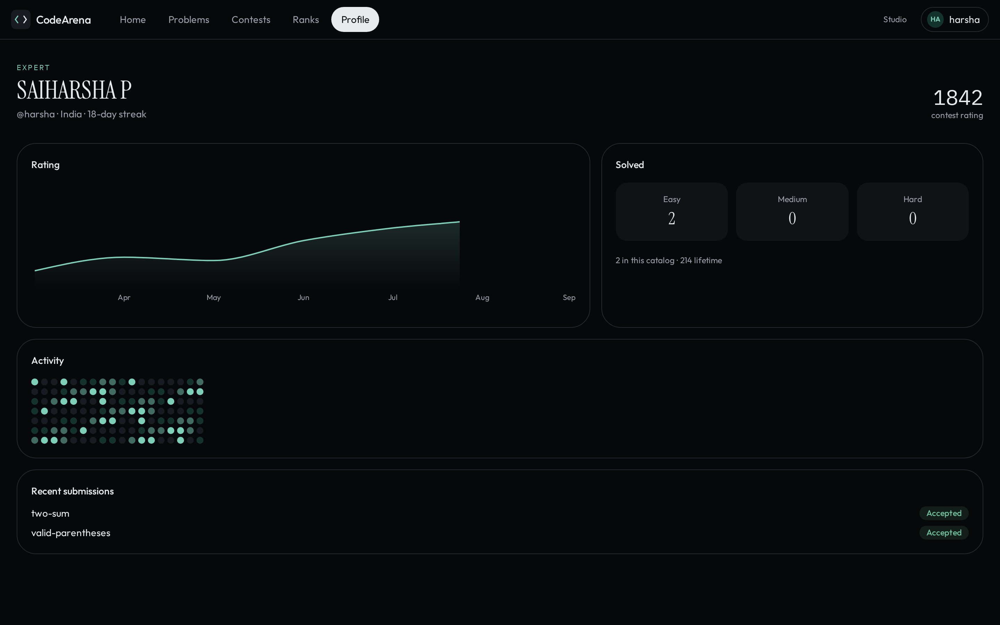

# CodeArena

I built CodeArena because I wanted to understand how an online judge actually works — not just a problem list and an editor, but the path a submission takes from the workspace to a verdict.

It is inspired by platforms like LeetCode and Codeforces. I did not try to clone them. I wanted the pieces to be real: a catalog, a workspace, a queue, a worker that never runs inside the API process, contests with a live window, and a rating board.



This is the home screen. When a round is open, the live contest sits on the right. The daily challenge is the problem I would open first.

## Solving a problem

The catalog is filterable by difficulty, tag, and unsolved. Each row shows acceptance, frequency, and whether I have already got AC on it.



The workspace is the screen I spend the most time on. Statement, examples, and constraints on the left. Editor, language, sample I/O, Run, and Submit on the right. Panels resize so I can give the statement or the editor more room.



Run checks the visible samples. Submit goes through the queue: `PENDING` → `RUNNING` → a final verdict. User code is never executed inside the Express request.



Every attempt is kept. I can filter history, open a previous run, and compare it with the one before.



Editorials stay locked until I have attempted the problem. After the first submit, the write-up, discussions, and my private notes are all in the same workspace tabs.

## How a submission actually works

```text
Browser  →  API  →  Queue  →  Worker  →  Judge0 / Docker
                ↘ PENDING row
                              ↘ RUNNING
                                           ↘ AC / WA / TLE / RE / CE
```

1. I submit from the workspace.
2. The API authenticates, validates the problem, language, and payload, then writes a `PENDING` row.
3. The submission id is pushed onto Redis / BullMQ.
4. A worker — a different process, preferably a different machine — marks it `RUNNING`.
5. The worker runs the saved test cases through Judge0 or a local Docker executor.
6. Output is compared with expected output, or a custom checker is used when exact matching is not enough.
7. The final verdict is saved. The UI follows the row over SSE, with polling as a fallback.

That split is the whole product. The editor, contests, and editorials sit around it.

## Contests and rating

Contests have a live window. Submissions are accepted only while the round is open. Past rounds stay available for upsolve. Registration is persisted, and the problemset is the same workspace I use for practice.





The global board is a snapshot of rating, title, and solved count. My row is highlighted so I can see where I sit without hunting.



The profile is the long view: rating history, easy/medium/hard split, a heatmap, and the recent verdicts.



## Tech stack

| Area | What I used |
| --- | --- |
| Frontend | React, Vite, TypeScript, Tailwind CSS, Monaco Editor |
| Backend | Node.js, Express, TypeScript, Prisma |
| Database | PostgreSQL |
| Queue | Redis with BullMQ |
| Execution | Judge0, Docker executor, mock executor for tests |
| Other | JWT auth, Zod, Swagger, Pino |

## Judge modes

| Mode | When I use it |
| --- | --- |
| `mock` | Tests and controlled demos. It does not execute user code. |
| `docker` | Local containers on my machine. |
| `judge0` | Real execution. This is the main path. |

## What I implemented

**Workspace**
- Problem list with filters, tags, difficulty, and solved status
- Stats: acceptance rate, solved count, submission count, richer sorting
- Daily challenge, curated sets, and next-problem recommendation
- Study plans with ordered problems, daily unlock, badges, and a revision queue
- Resizable panels, Monaco, sample run, custom input, and submit
- Editor settings: theme, font size, tab size, word wrap, minimap, reset, autosave
- Tabs for description, editorial, submissions, solutions, discussions, and notes
- Editorials unlock after a logged-in attempt; admins can still preview drafts

**Judge**
- Queued submissions with `PENDING`, `RUNNING`, and a final verdict
- Live status over SSE, with polling fallback
- Redis pub/sub live events when `REDIS_URL` is set
- Submission history filters and comparison with a previous attempt
- Approximate runtime / memory percentile
- Accepted solutions can be shared as persisted posts with visibility and votes
- Language catalog from the database, with Judge0 language sync
- Custom checkers when exact output matching is not enough
- Test-case generation with a generator, reference solution, and validator

**Contests and people**
- Contests, registration, upsolve, leaderboard, and clarifications
- Submissions accepted only during the live window
- Virtual contest and mock interview practice pages
- Global and per-problem leaderboards
- Public profiles, badges, country/global rank, rating history, topic strength, submission calendar, activity, and follows
- Notifications for follows, solution votes, and report updates

**Admin**
- Problem creation with sample and hidden tests, including draft and archived states
- User, language, contest, preview, testcase validation, and monitoring pages
- Launch analytics, moderation queues, audit logs, backups, health snapshots
- Rejudge for one submission or a filtered error batch
- Swagger at `/api-docs`

## Project structure

```text
apps/api      Express API, Prisma, queues, workers, executors
apps/web      React frontend
docs/         Architecture, setup, testing, API notes
docker/       API and web Dockerfiles
examples/     Generator, checker, and reference scripts
scripts/      Local Judge0 helpers
```

Backend flow: `routes → controllers → services → repositories`  
Frontend flow: `pages/features → components → API services → backend`

## Running locally

Requirements: Node.js 20+, PostgreSQL, Redis. Judge0 only if I want real execution.

```bash
npm install
cp .env.example .env
```

`.env` needs at least:

```text
DATABASE_URL=...
REDIS_URL=...
JWT_ACCESS_SECRET=...
JWT_REFRESH_SECRET=...
```

Then:

```bash
npm run db:generate
npm run db:migrate
npm run db:seed
npm run dev
```

- Web: `http://localhost:5173`
- API: `http://localhost:4000`
- Swagger: `http://localhost:4000/api-docs`

### Demo accounts

| Role | Email | Password |
| --- | --- | --- |
| Admin | admin@example.com | password |
| User | user@example.com | password |

Older seed data also uses `admin@codearena.dev` / `Password123!` and `demo@codearena.dev` / `Password123!`.

### Docker Compose

```bash
docker compose up --build
npm run db:migrate
npm run db:seed
```

### Judge0

On my Windows machine, running Judge0 through Docker Desktop / WSL caused issues, so I used a Linux VM and pointed the app at that VM.

Inside the VM:

```bash
chmod +x scripts/bootstrap-judge0-linux-vm.sh
./scripts/bootstrap-judge0-linux-vm.sh
```

From Windows:

```powershell
npm run judge0:local:connect -- -Judge0BaseUrl http://<VM_IP>:2358
npm run dev
```

More notes: [docs/LOCAL_JUDGE0_SETUP.md](docs/LOCAL_JUDGE0_SETUP.md).

## Testing

API tests use in-memory repositories and the mock executor, so they do not need PostgreSQL, Redis, Docker, or Judge0.

```bash
npm run lint
npm run typecheck
npm test
```

Coverage includes auth, problems, submissions, the queue/worker flow, contests, leaderboards, discussions, language selection, Judge0 mapping, custom checkers, test-case generation, solution sharing, follows, notifications, reports, audit logs, monitoring, backups, and ratings.

## Docs

| File | Content |
| --- | --- |
| [docs/API_SPEC.md](docs/API_SPEC.md) | Routes and response shape |
| [docs/AUTH_FLOW.md](docs/AUTH_FLOW.md) | JWT and refresh tokens |
| [docs/DATABASE_SCHEMA.md](docs/DATABASE_SCHEMA.md) | Prisma models and indexes |
| [docs/HLD.md](docs/HLD.md) | High-level design |
| [docs/LLD.md](docs/LLD.md) | Low-level design |
| [docs/JUDGE_ARCHITECTURE.md](docs/JUDGE_ARCHITECTURE.md) | Judge, executor, verdicts |
| [docs/LANGUAGE_SYSTEM.md](docs/LANGUAGE_SYSTEM.md) | Language catalog |
| [docs/TESTCASE_GENERATION.md](docs/TESTCASE_GENERATION.md) | Generator, reference, checker |
| [docs/LOCAL_JUDGE0_SETUP.md](docs/LOCAL_JUDGE0_SETUP.md) | Local Judge0 |
| [docs/DEPLOYMENT.md](docs/DEPLOYMENT.md) | Production notes |
| [docs/TESTING.md](docs/TESTING.md) | Test strategy |
| [docs/FRONTEND_ARCHITECTURE.md](docs/FRONTEND_ARCHITECTURE.md) | Frontend structure |
| [docs/FEATURE_ROADMAP.md](docs/FEATURE_ROADMAP.md) | What is still open |
| [docs/LEARNINGS.md](docs/LEARNINGS.md) | What I learned while building this |

## Still open

- No plagiarism detection yet
- Multi-file submissions are not supported
- Virtual contest history and mock interview reports are still browser-local
- Helpful comment markers are still browser-local
- Frozen contest standings are not done
- Docker Compose does not auto-run migrations
- Deployed Redis mode needs the API and worker on the same `REDIS_URL`

I built this to go past a normal CRUD app and learn the boundaries that make a judge safe: queues, hidden tests, workers, and a frontend that can actually show the verdict arriving.
